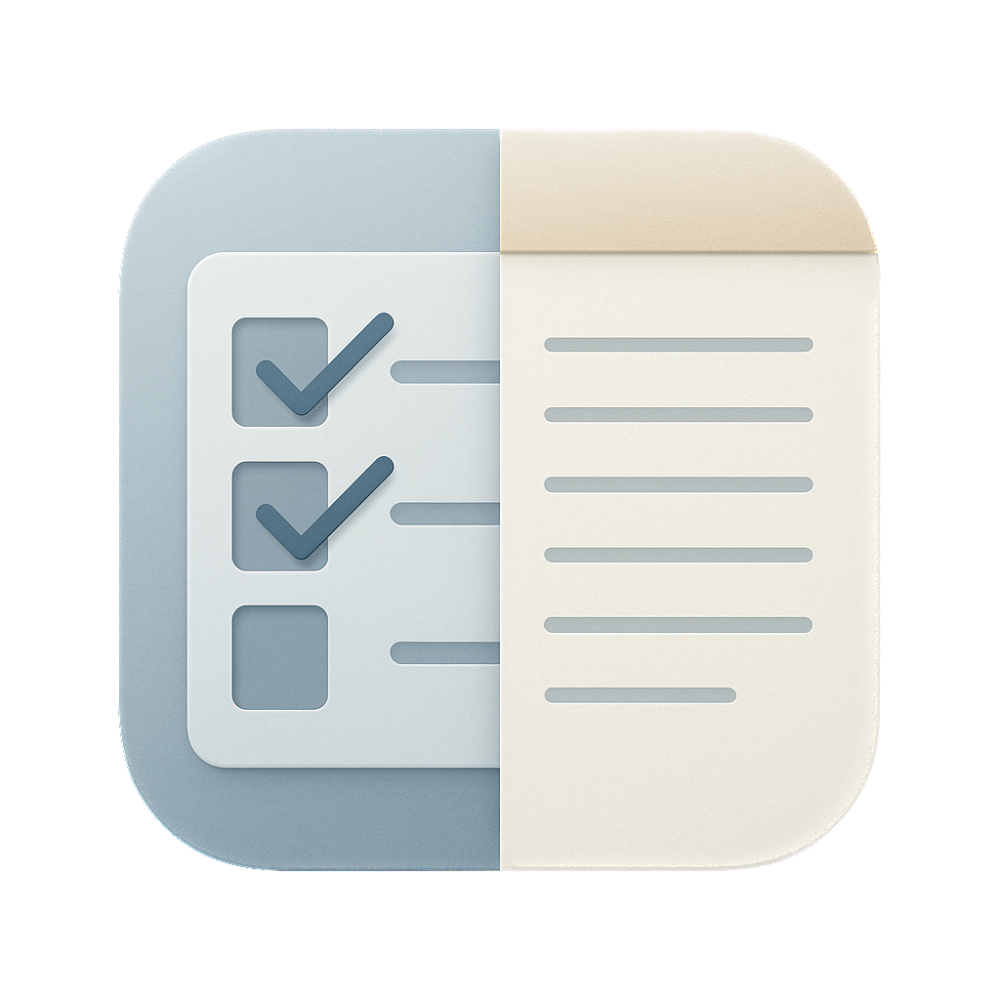

# notes&dotes

A modern macOS application that combines task management and note-taking in a clean, intuitive interface. Built with SwiftUI, notes&dotes provides a seamless experience for organizing your daily tasks and thoughts.



## ✨ Features

### 📝 Task Management
- **Quick Task Addition**: Add new tasks with a simple text input
- **Task Completion**: Mark tasks as complete with visual checkmarks
- **Task Deletion**: Remove completed or unnecessary tasks
- **Persistent Storage**: All tasks are automatically saved and restored

### 📖 Note Taking
- **Rich Text Editor**: Full-featured text editor for your notes
- **Auto-Save**: Notes are automatically saved as you type
- **File Import**: Open existing note files with the `.txt` format
- **Persistent Storage**: Notes are saved locally and restored on app launch

### 🎨 User Interface
- **Split View Layout**: Tasks on the left, notes on the right
- **Clean Design**: Minimalist interface with native macOS styling
- **Responsive Layout**: Adapts to different window sizes
- **Transparent Title Bar**: Modern window styling for a seamless experience

### 💾 Data Management
- **Local Storage**: All data is stored locally in your Documents folder
- **File Export/Import**: Share your tasks and notes between devices
- **Automatic Backup**: Data is automatically saved to prevent loss

## 🚀 Installation

### Prerequisites
- macOS 12.0 or later
- Xcode 14.0 or later (for development)

### Building from Source
1. Clone the repository:
   ```bash
   git clone https://github.com/yourusername/notes-dotes.git
   cd notes-dotes
   ```

2. Open the project in Xcode:
   ```bash
   open notes\&dotes.xcodeproj
   ```

3. Build and run the project:
   - Press `Cmd + R` in Xcode, or
   - Click the "Run" button in the toolbar

## 📱 Usage

### Getting Started
1. Launch the application
2. The interface is divided into two sections:
   - **Left Panel**: Task management
   - **Right Panel**: Note taking

### Managing Tasks
- **Add a Task**: Type in the text field and press Enter or click the "+" button
- **Complete a Task**: Click the circle next to a task to mark it as complete
- **Delete a Task**: Click the trash icon next to a task to remove it

### Taking Notes
- **Start Writing**: Click in the notes area and begin typing
- **Auto-Save**: Your notes are automatically saved as you type
- **Import Files**: Use `Cmd + O` to open existing text files

### File Operations
- **Open File**: `Cmd + O` - Opens a text file with tasks and notes
- **New**: `Cmd + N` - Creates a new workspace (placeholder for future implementation)

## 🏗️ Architecture

### Technology Stack
- **SwiftUI**: Modern declarative UI framework
- **Foundation**: Core data management and file operations
- **Combine**: Reactive programming for state management

### Key Components

#### Data Models
```swift
struct Task: Identifiable, Codable {
    let id = UUID()
    var title: String
    var isCompleted: Bool = false
    let createdAt = Date()
}
```

#### Data Manager
- **Singleton Pattern**: `DataManager.shared` for centralized data management
- **File Operations**: Handles reading/writing to local storage
- **JSON Encoding**: Tasks are stored as JSON for easy parsing
- **Separator-based Storage**: Uses `###$$###` separator to distinguish tasks from notes

#### State Management
- **ObservableObject**: `TaskStore` manages task state
- **@Published**: Automatic UI updates when data changes
- **NotificationCenter**: Handles file operation events

### File Structure
```
notes&dotes/
├── notes_dotesApp.swift      # Main app entry point
├── ContentView.swift         # Main UI implementation
├── Assets.xcassets/         # App icons and assets
└── notes_dotes.entitlements # App permissions
```

## 🔧 Development

### Project Structure
- **SwiftUI Views**: Modern declarative UI components
- **Data Layer**: Centralized data management with `DataManager`
- **State Management**: Observable objects for reactive updates
- **File I/O**: Robust file handling with error management

### Key Features Implementation

#### Window Styling
```swift
window.titlebarAppearsTransparent = true
window.titleVisibility = .hidden
window.styleMask.insert(.fullSizeContentView)
```

#### File Operations
- **NSOpenPanel**: Native file picker for opening files
- **Error Handling**: Comprehensive error management with user alerts
- **File Validation**: Ensures opened files have the correct format

#### Data Persistence
- **Documents Directory**: Stores data in user's Documents folder
- **Atomic Writes**: Ensures data integrity during saves
- **UTF-8 Encoding**: Proper text encoding for international support

## 🎯 Roadmap

### Planned Features
- [ ] **Cloud Sync**: iCloud integration for cross-device synchronization
- [ ] **Task Categories**: Organize tasks by categories or tags
- [ ] **Due Dates**: Add deadlines to tasks
- [ ] **Search Functionality**: Search through tasks and notes
- [ ] **Export Options**: Export to various formats (PDF, Markdown)
- [ ] **Dark Mode**: Enhanced dark mode support
- [ ] **Keyboard Shortcuts**: Additional keyboard shortcuts for power users

### Technical Improvements
- [ ] **Unit Tests**: Comprehensive test coverage
- [ ] **Performance Optimization**: Optimize for large datasets
- [ ] **Accessibility**: Enhanced accessibility features
- [ ] **Localization**: Multi-language support

## 🤝 Contributing

We welcome contributions! Please feel free to submit issues and pull requests.

### Development Setup
1. Fork the repository
2. Create a feature branch: `git checkout -b feature/amazing-feature`
3. Commit your changes: `git commit -m 'Add amazing feature'`
4. Push to the branch: `git push origin feature/amazing-feature`
5. Open a Pull Request

### Code Style
- Follow Swift style guidelines
- Use meaningful variable and function names
- Add comments for complex logic
- Ensure proper error handling

## 📄 License

This project is licensed under the MIT License - see the [LICENSE](LICENSE) file for details.

## 🙏 Acknowledgments

- Built with SwiftUI and native macOS frameworks
- Inspired by the need for a simple, effective task and note management tool
- Thanks to the SwiftUI community for inspiration and guidance

## 📞 Support

If you encounter any issues or have questions:
- Open an issue on GitHub
- Check the existing issues for solutions
- Review the code comments for implementation details

---

**Made with ❤️ using SwiftUI** 